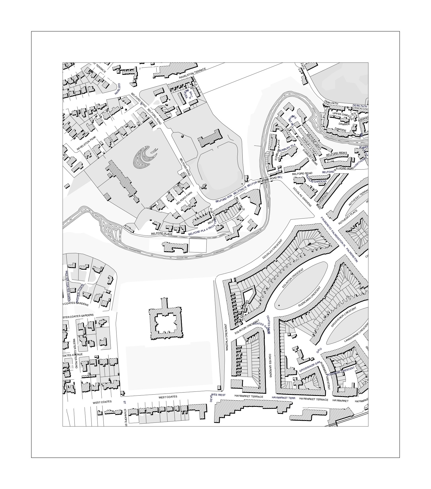

[](https://github.com/leifgehrmann/map-engraver/actions)
[](https://codecov.io/gh/leifgehrmann/map-engraver)

Hello! `map-engraver` is currently being refurbished for 2021. This means it'll
be going through a lot of changes which means a lot of the functionality shown
below won't be relevant anymore. When refurbishments are complete, the README
will be updated. If you want to check out the old functionality, use the
following branch:

https://github.com/leifgehrmann/map-engraver/tree/old-master

----

Tool for creating maps in the style of engraved maps.

### Usage

`python3 map-engraver/map-engraver.py myMap.yml`

Where `myMap.yml` contains some config on what to draw. See the `example` directory for how this is structured.

### Example

```
# Download data from OSM
wget -O example/data.osm https://api.openstreetmap.org/api/0.6/map?bbox=-3.23028126,55.94554937,-3.21659279,55.95352525

# Render the map
python3 map-engraver/map-engraver.py ./example/map.yml
```



---

## The new map-engraver

These are the instructions for the NEW map-engraver:

### Installing

1. Install poetry
2. `poetry install`

### Runnings tests

1. `poetry run pytest --cov`
